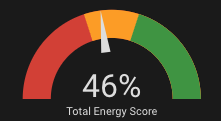
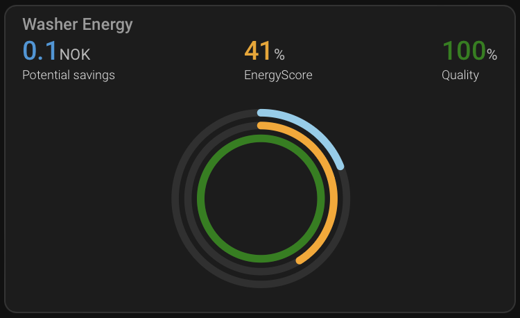

This page is meant to be a collection of different ways to visualise EnergyScore so users can share their ideas. Please contribute with your own visualisations!

# Standard lovelace

The EnergyScore can be visualised directly using standard lovelace visuals, like sensor or entity cards. The example below is from using the gauge card:



# ApexChart

More advanced visualisations can also be created, e.g. with the [ApexCharts-card](https://github.com/RomRider/apexcharts-card) custom lovelace card. The following example uses the RadialBar option and a template sensor to create the percentage of potential savings vs cost.



To set up this, use this configuration for the apexchart-card:

```yaml
type: custom:apexcharts-card
apex_config:
  legend: false
  chart:
    height: 240px
show:
  loading: true
experimental:
  color_threshold: true
header:
  show: true
  title: Washer Energy
  show_states: true
  colorize_states: true
chart_type: radialBar
series:
  - entity: sensor.washer_potential_percentage
    name: Potential savings
    show:
      in_chart: true
      in_header: false
    color_threshold:
      - value: 0
        color: skyblue
  - entity: sensor.washer_potential_savings
    name: Potential savings
    show:
      in_chart: false
      in_header: true
  - entity: sensor.washer_score
    name: EnergyScore
    show:
      in_chart: true
      header_color_threshold: true
    color_threshold:
      - value: 0
        color: red
      - value: 40
        color: orange
      - value: 60
        color: green
  - entity: sensor.washer_score
    attribute: quality
    transform: return x * 100;
    name: Quality
    max: 100
    show:
      in_chart: true
      header_color_threshold: true
    color_threshold:
      - value: 0
        color: red
      - value: 50
        color: orangered
      - value: 70
        color: orange
      - value: 90
        color: green

        color: green

```
